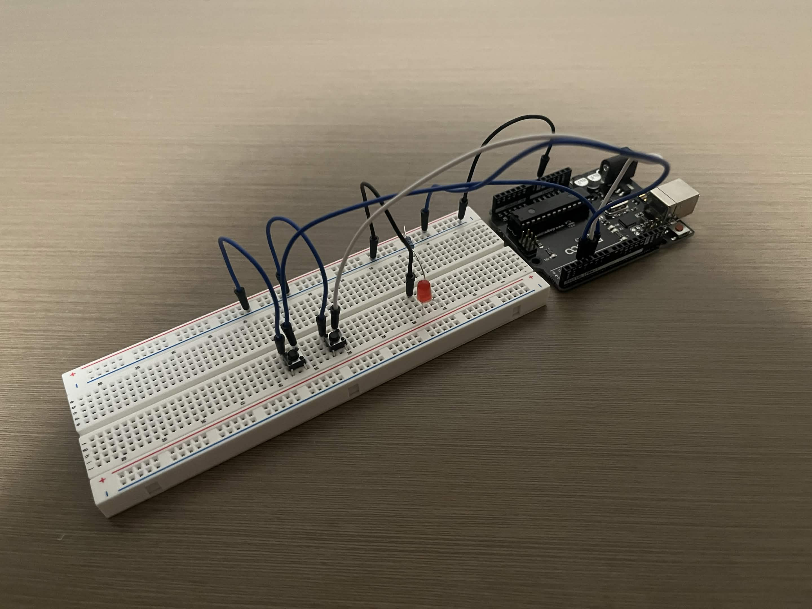

# AND Blink

## Project Goal
This project examines one of the most foundational units of digital logic - the AND gate. It uses
a configuration of two pushbuttons and an LED to simulate the logic of an AND gate so that the
LED illuminates only when both buttons are pressed simultaneously. 

This was built as a hands-on exercise to reinforce the logic gate concepts covered in ECE 200 Digital Logic Design class.

## Components
- ELEGOO UNO R3 (Arduino-compatible)
- 2x pushbutton
- 1x LED
- 1x 220Ω resistor
- Jumper wires
- Breadboard

## Wiring
- LED → Pin 2
- Button 1 → Pin 3
- Button 2 → Pin 4

## Picture

## How Does It Work?
Both buttons are configured with INPUT_PULLUP, meaning their default state is HIGH.
When pressed, they read LOW. The loop continuously checks the state of each button, and
the blink() function fires only when both pushbuttons read low. In other words, the LED
blinks when the first button is pressed AND the second one is pressed simultaneously.

## What Did I Learn?
Building this circuit reinforced my understanding of pushbuttons in hardware and the Arduino Programming Language, and
applying the concepts I learned in Digital Logic Design class to real hardware helped deepen my understanding of 
circuits and digital logic.

